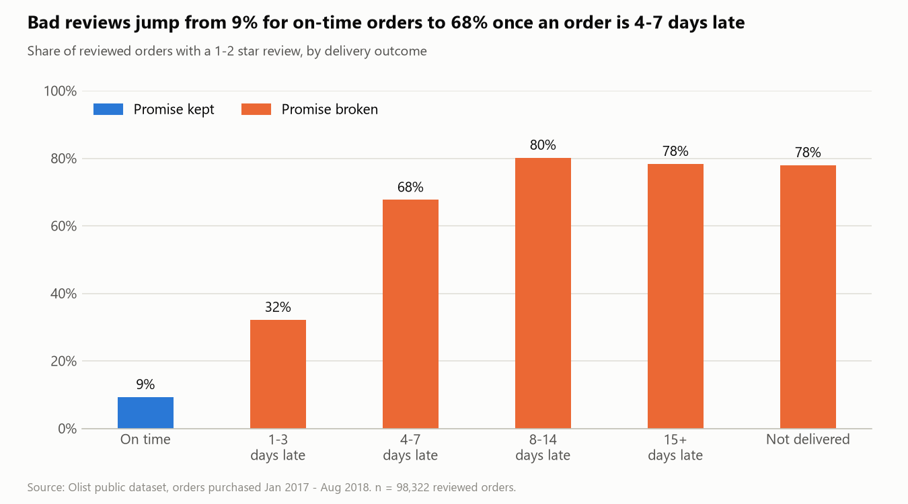
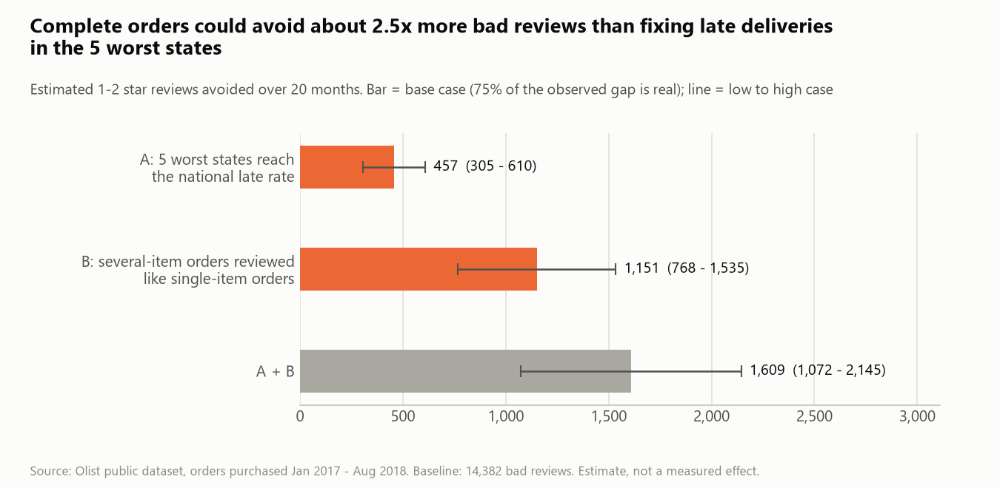
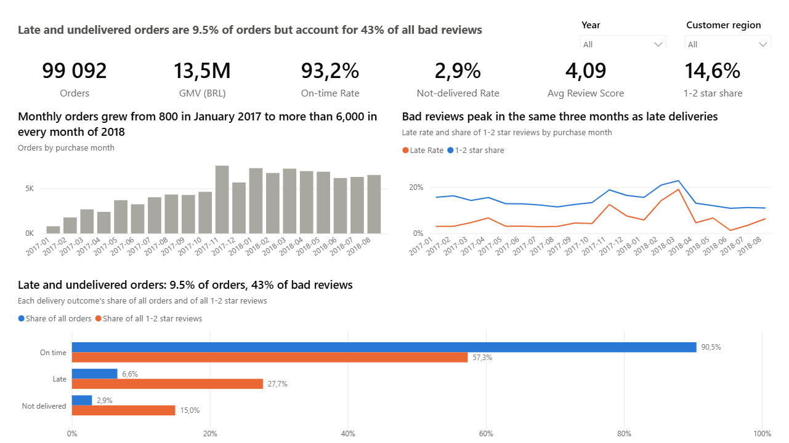
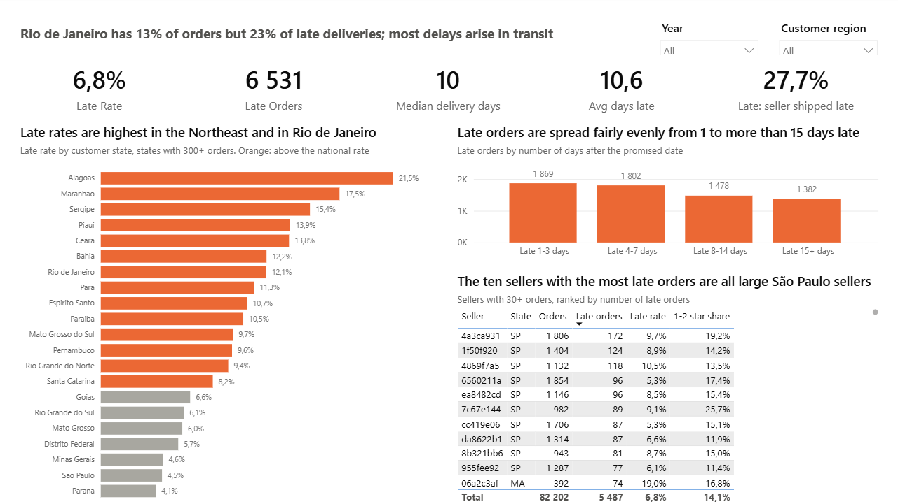
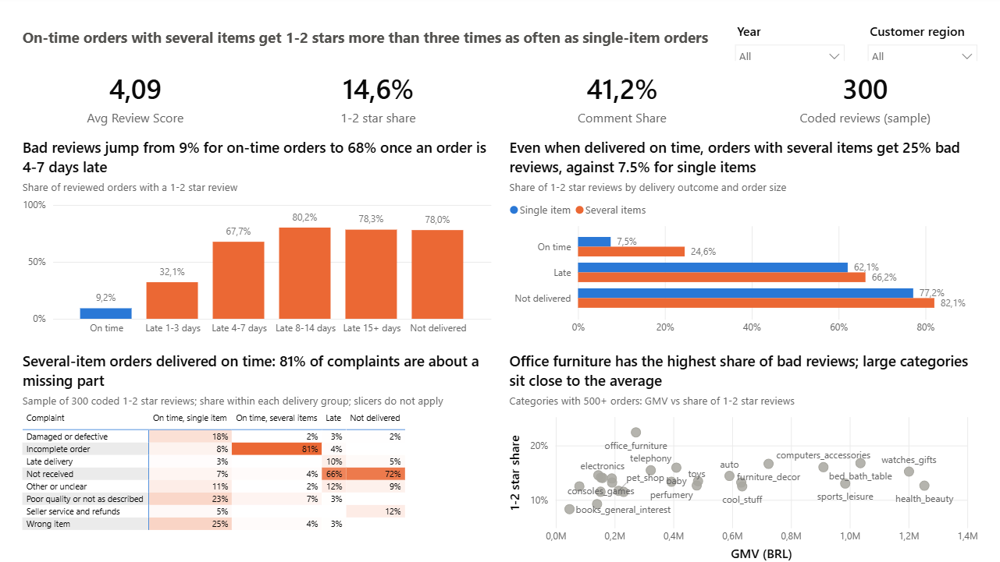
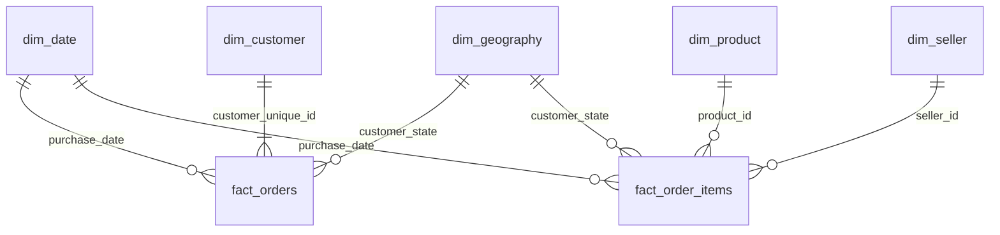

# Late Deliveries, Lost Customers

**Why do customers of an online marketplace give bad reviews, and what should management fix first?**
A business analysis of 99,092 orders and 300 customer reviews from Olist, a Brazilian e-commerce marketplace.

> **Result.** Orders that arrive late or not at all are 9.5% of orders but 42.7% of all 1–2 star reviews, and
> orders with several items often arrive incomplete. Complete orders and on-time delivery in the five worst
> states could remove about 1,600 bad reviews, 11% of the total (range 1,072 to 2,145).

| Start here | What it is |
|---|---|
| [One-page summary](docs/one_page_summary.pdf) | The answer on one page (PDF) |
| [Deck](deck/late_deliveries_lost_customers.pdf) | Ten slides for the Head of Operations (PDF) |
| [Dashboard](dashboard/README.md) | Three-page Power BI report |
| [Analysis findings](docs/analysis_findings.md) | Issue tree and 12 tested hypotheses |

SQL (DuckDB) · Python · Power BI · PowerPoint

## Business question

Framed as a request from Olist's Head of Operations:
*"Why do customers give bad reviews, how much does it cost the business, and what should management fix first?"*

| Question | Short answer |
|---|---|
| Why do customers give bad reviews? | Because the delivery promise was broken (late, or never arrived), because part of the order was missing, and otherwise because of the product itself (wrong, damaged, not as described). |
| How much does it cost? | 14,382 bad reviews in 20 months: 14.6% of reviewed orders. Late and undelivered orders alone produce 6,134 of them. The cost is counted in reviews, not in money: the data has no costs or commissions, and the link to repeat purchases rests on 103 customers. |
| What should management fix first? | Order completeness, then transit on the worst routes, then a warning to customers before a promise is missed. |

## Key findings

1. **A broken delivery promise is the strongest driver of bad reviews.** 62.4% of late orders and 78.0% of orders
   that never arrive get 1–2 stars, against 9.2% of on-time orders. Together they are 9.5% of orders and 42.7%
   of all bad reviews.
2. **The delay arises in transit on specific routes, not with a few bad sellers.** Rio de Janeiro has 12.9% of
   orders but 22.9% of late deliveries. 72.3% of late orders were handed to the carrier in time, and the worst
   10% of sellers account for only 15.0% of late orders.
3. **Orders with several items arrive on time, but often incomplete.** They get 1–2 stars 24.6% of the time,
   against 7.5% for single-item orders. In 300 coded reviews, 81% of the complaints in this group (95% CI
   69–90%) say that part of the order is missing. These orders count as "on time" in the 93.2% on-time rate.



These are strong associations in observational data, not proven effects; see [Limitations](#limitations).
Freight cost and order value were also tested as drivers and were not supported by the data.

## Recommendations

| # | Action | Why | Estimated impact over 20 months | First step |
|---|---|---|---|---|
| 1 | **Make every order complete, and measure it** | 9,096 on-time orders with several items get 24.6% bad reviews, against 7.5% for single items | About 1,151 fewer bad reviews (768 to 1,535) | Audit 100 several-item orders marked as delivered: was the missing part sent later, or never sent? |
| 2 | **Fix transit to Rio de Janeiro and the Northeast** | Five states hold 1,079 late orders above the national rate; late parcels spend a median 26 days in transit, against 7 | About 457 fewer bad reviews (305 to 610) | Build a carrier scorecard by route and review the promised dates there |
| 3 | **Warn customers before a promise is missed** | Bad reviews go from 32% at 1–3 days late to 68% at 4–7 days | Not quantified: needs a test | Send a new delivery date to half of the at-risk orders and compare the reviews |

Actions 1 and 2 together would move the share of 1–2 star reviews from 14.6% to about 13.0% (12.4% to 13.5%).
The impact figures come from a [scenario](docs/scenario.md) with a low, base and high case: they are estimates
of the size of each lever, not forecasts. Even if every late order in the country arrived on time, at most 23.6%
of bad reviews would disappear, so delivery alone cannot solve the problem.



## Dashboard

A three-page Power BI report, built from code as a Power BI Project ([details](dashboard/README.md)).







## Approach

| Step | What was done | Where to look |
|---|---|---|
| 1. Understand and clean the data | 9 raw tables profiled; 32 data quality issues measured, decided and documented | [Data dictionary](docs/data_dictionary.md), [decision log](docs/decision_log.md) |
| 2. Build the data model | Star schema in SQL: 2 fact tables and 5 dimensions, checked by 37 tests that reconcile it with the raw data | [`sql/`](sql), [data model](docs/data_model.md), [validation report](docs/model_validation_report.md) |
| 3. Define the metrics | 13 KPIs, each with business definition, formula, grain, filters and caveats | [Metric definitions](docs/metric_definitions.md), [KPI baseline](docs/kpi_baseline.md) |
| 4. Test hypotheses | Issue tree with 12 hypotheses: 6 supported, 3 partly supported, 2 not supported, 1 unclear | [Analysis findings](docs/analysis_findings.md), [result tables](docs/analysis_results.md) |
| 5. Read what customers write | Stratified random sample of 300 out of 10,636 bad reviews with a comment, coded in the original Portuguese with a codebook of 8 complaint types, blind to the delivery outcome | [Review coding findings](review_coding/findings.md), [codebook](review_coding/codebook.md) |
| 6. Size the opportunity | Two scenarios with low, base and high cases and explicit assumptions | [Scenario](docs/scenario.md) |
| 7. Make it usable | Power BI dashboard (3 pages, 44 DAX measures), every visual checked against reference values | [Dashboard](dashboard/README.md) |
| 8. Tell the story | Ten-slide deck and a one-page summary, built from the same numbers | [Deck](deck/README.md), [one-page summary](docs/one_page_summary.pdf) |

Every number in the deck, the dashboard and this page comes from a generated report in this repository, and
each report can be rebuilt from the raw data with one command (see [How to reproduce](#how-to-reproduce)).

## Data model

A star schema in DuckDB: two fact tables at different grains that share the date and geography dimensions.
Field definitions and design reasons are in [docs/data_model.md](docs/data_model.md).



- `fact_orders` (one row per order, 99,092 rows): delivery outcome, delay, order value, review score
- `fact_order_items` (one row per unit sold, 112,279 rows): seller, product, price, freight

Why two fact tables: delivery and the review belong to the order, while seller and product belong to the item.
One combined table would repeat every order once per item and inflate each order-level count. The two tables
are never joined to each other; they meet through the shared dimensions.

## Data quality decisions

All 32 issues, with rows affected, decision and reason, are in the [decision log](docs/decision_log.md).
These are the choices that change headline numbers:

| Issue | Decision | Effect |
|---|---|---|
| Incomplete months at both ends of the period | Analysis period set to January 2017 to August 2018 | 349 of 99,441 orders (0.35%) excluded; monthly trends have no false drops |
| Orders that were never delivered | Kept and flagged as `Not delivered`; excluded only from delivery-time metrics | They are 3% of orders but carry 15% of the bad reviews; dropping them would hide a main source of dissatisfaction |
| The promised date has no time of day | "Late" compares calendar dates; delivery on the promised day is on time | A timestamp comparison would count 1,292 same-day deliveries as late and inflate the late count by 20% |
| Several reviews for the same order (547 orders) | One review per order: the most recently answered | Each order is counted once in satisfaction metrics |
| Several orders by the same person on the same day | A repeat customer has orders on more than one calendar day | 2,129 repeat customers instead of 2,975; counting split orders would overstate loyalty by 40% |
| Reviews answered before the parcel arrived | Kept and flagged | 70.1% of reviewed late orders were rated while the customer was still waiting, which shapes how the late-delivery effect must be read |

## Limitations

- **No experiment.** The data is observational. The late-delivery effect is large, rises with the length of the
  delay and holds in every region, value band and year, but hidden factors cannot be excluded.
  [Why this is not proof of causation](docs/analysis_findings.md#5-correlation-or-causation).
- **Survey timing.** The review survey is sent around the promised date, so most late customers answer while
  still waiting. A survey sent after delivery could show a smaller gap.
- **Impact in reviews, not in money.** Costs, commissions and margins are not in the data, so no return on
  investment is computed. The link from bad reviews to lost customers is an indication only: customers whose
  first order was late return less often (1.62% against 2.25%), based on 103 returning customers.
- **The scenario is an estimate.** It treats 50%, 75% or 100% of an observed difference as a real effect.
  These factors are assumptions, not measurements.
- **Review coding.** 300 reviews, coded by a single coder; a second pass on 30 reviews checks consistency, not
  validity. Only customers who wrote a comment are represented. The codebook, every review text and every
  coding decision are in [`review_coding/`](review_coding), so each one can be checked.
- **One marketplace, one period.** Orders from 2017 and 2018; the results describe Olist in that period.

## How to reproduce

1. Download the dataset from Kaggle:
   [Brazilian E-Commerce Public Dataset by Olist](https://www.kaggle.com/datasets/olistbr/brazilian-ecommerce)
   and unzip the 9 CSV files into `data/raw/`.
2. Create the environment (Python 3.13):
   ```
   python -m venv .venv
   .venv\Scripts\activate
   pip install -r requirements.txt
   ```
3. Build the database, the star schema, the KPI views and the Parquet exports (runs every file in `sql/` in order):
   ```
   python run_sql.py
   ```
4. Regenerate the reports in `docs/`:
   ```
   python notebooks/00_data_profiling.py
   python notebooks/01_data_quality_checks.py
   python notebooks/02_model_validation.py
   python notebooks/03_kpi_baseline.py
   python notebooks/04_hypothesis_analysis.py
   python notebooks/05_review_sample.py
   ```
5. Compute the review coding results from `review_coding/coding.csv`, then the scenario and the dashboard
   reference values:
   ```
   python notebooks/06_review_coding_results.py
   python notebooks/07_scenario.py
   python notebooks/08_dashboard_reference.py
   ```
6. Build the Power BI project and open `dashboard/olist_delivery_dashboard.pbip` (click *Refresh now* once):
   ```
   python dashboard/build_pbip.py
   ```
7. Build the deck (needs Node.js) and the one-page summary (needs Edge or Chrome):
   ```
   python notebooks/09_deck_data.py
   python notebooks/10_one_page_summary.py
   cd deck
   npm install
   node build_deck.js
   ```

## Repository structure

```
data/raw/         raw CSV files (not committed, see "How to reproduce")
data/processed/   DuckDB database and Parquet exports for Power BI (not committed, built by the scripts)
sql/              load, model and KPI queries, numbered in run order
notebooks/        analysis scripts, numbered in run order; each writes a report or a data file
review_coding/    codebook, sample and coded results of the qualitative review analysis
dashboard/        Power BI project (model, report, measures), build script and screenshots
deck/             consulting deck (PDF and PowerPoint), build script and its data
docs/             one-page summary, data dictionary, decision log, data model, metric definitions,
                  findings, scenario, generated reports and charts
```

All documents:

- [One-page summary](docs/one_page_summary.pdf): the answer, findings, recommendations and limits on one page
- [Deck](deck/README.md): storyline, PDF and PowerPoint file, build script
- [Dashboard](dashboard/README.md): the Power BI project, its pages, measures and checks
- [Scenario](docs/scenario.md): what fixing late deliveries and incomplete orders could achieve, with assumptions and ranges
- [Review coding findings](review_coding/findings.md): what customers complain about in 300 coded reviews, with quotes
- [Review coding files](review_coding/README.md): codebook, sampling method, coding and consistency check
- [Analysis findings](docs/analysis_findings.md): issue tree, 12 hypotheses with test, result and conclusion, charts
- [Analysis results](docs/analysis_results.md): the generated tables behind the findings
- [Metric definitions](docs/metric_definitions.md): business definition, formula, grain, filters and caveats of every KPI
- [KPI baseline](docs/kpi_baseline.md): generated reference values, total and by month
- [Data model](docs/data_model.md): star schema, derived field definitions, Power BI relationships
- [Model validation report](docs/model_validation_report.md): 37 tests reconciling the model with the raw data
- [Data dictionary](docs/data_dictionary.md): tables, grain, relationships, columns and known issues
- [Profiling report](docs/profiling_report.md): generated row counts, nulls, keys and relationship checks
- [Decision log](docs/decision_log.md): every data quality issue, rows affected, decision and reason
- [Data quality report](docs/data_quality_report.md): the generated counts behind the decision log

## Data source and licence

Data: *Brazilian E-Commerce Public Dataset by Olist*, published on Kaggle by Olist under the
[CC BY-NC-SA 4.0](https://creativecommons.org/licenses/by-nc-sa/4.0/) licence.
This project is non-commercial and for educational purposes. The raw data is not redistributed here.
