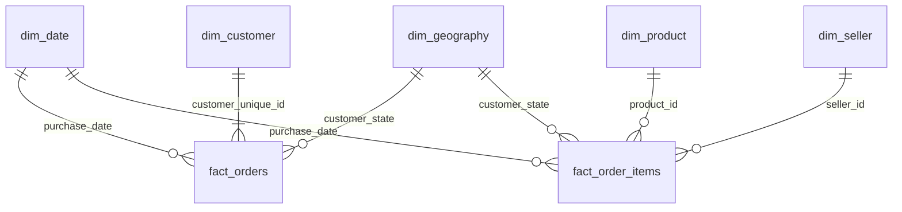

# Late Deliveries, Lost Customers

Business analysis of customer dissatisfaction on the Olist Brazilian e-commerce marketplace.

> **Status: work in progress.** Data understanding, data quality review, data model and metric definitions are complete.
> Findings, dashboard and recommendations will be added as the analysis progresses: [TBD].

## Business question

*Why do customers give bad reviews, how much does it cost the business, and what should management fix first?*

Framed as a request from Olist's Head of Operations.

## Repository structure

```
data/raw/         raw CSV files (not committed, see "How to reproduce")
data/processed/   DuckDB database and Parquet exports for Power BI (not committed, built by the scripts)
sql/              load, model and KPI queries, numbered in run order
notebooks/        exploration scripts, numbered
review_coding/    codebook, sample and coded results of the qualitative review analysis
dashboard/        Power BI file and screenshots
deck/             slide deck (PDF)
docs/             data dictionary, profiling report, metric definitions, decision log
```

## Data model

A star schema in DuckDB: two fact tables at different grains sharing the date and geography dimensions.
Field definitions and design reasons are in [docs/data_model.md](docs/data_model.md).



- `fact_orders` (one row per order): delivery outcome, delay, order value, review score
- `fact_order_items` (one row per unit sold): seller, product, price, freight

## Documentation

- [Metric definitions](docs/metric_definitions.md): business definition, formula, grain, filters and caveats of every KPI
- [KPI baseline](docs/kpi_baseline.md): generated reference values, total and by month
- [Data model](docs/data_model.md): star schema, derived field definitions, Power BI relationships
- [Model validation report](docs/model_validation_report.md): 36 tests reconciling the model with the raw data
- [Data dictionary](docs/data_dictionary.md): tables, grain, relationships, columns and known issues
- [Profiling report](docs/profiling_report.md): generated row counts, nulls, keys and relationship checks
- [Decision log](docs/decision_log.md): every data quality issue, rows affected, decision and reason
- [Data quality report](docs/data_quality_report.md): the generated counts behind the decision log

## How to reproduce

1. Download the dataset from Kaggle:
   [Brazilian E-Commerce Public Dataset by Olist](https://www.kaggle.com/datasets/olistbr/brazilian-ecommerce)
   and unzip the 9 CSV files into `data/raw/`.
2. Create the environment (Python 3.13):
   ```
   python -m venv .venv
   .venv\Scripts\activate
   pip install -r requirements.txt
   ```
3. Build the database, the star schema, the KPI views and the Parquet exports (runs every file in `sql/` in order):
   ```
   python run_sql.py
   ```
4. Regenerate the reports in `docs/`:
   ```
   python notebooks/00_data_profiling.py
   python notebooks/01_data_quality_checks.py
   python notebooks/02_model_validation.py
   python notebooks/03_kpi_baseline.py
   ```

## Data source and licence

Data: *Brazilian E-Commerce Public Dataset by Olist*, published on Kaggle by Olist under the
[CC BY-NC-SA 4.0](https://creativecommons.org/licenses/by-nc-sa/4.0/) licence.
This project is non-commercial and for educational purposes. The raw data is not redistributed here.
