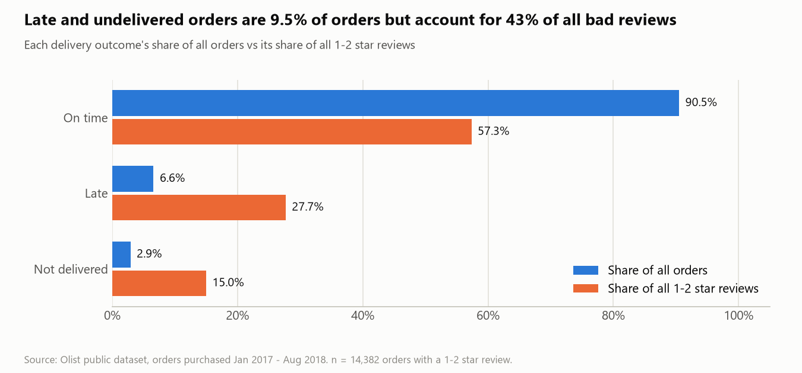
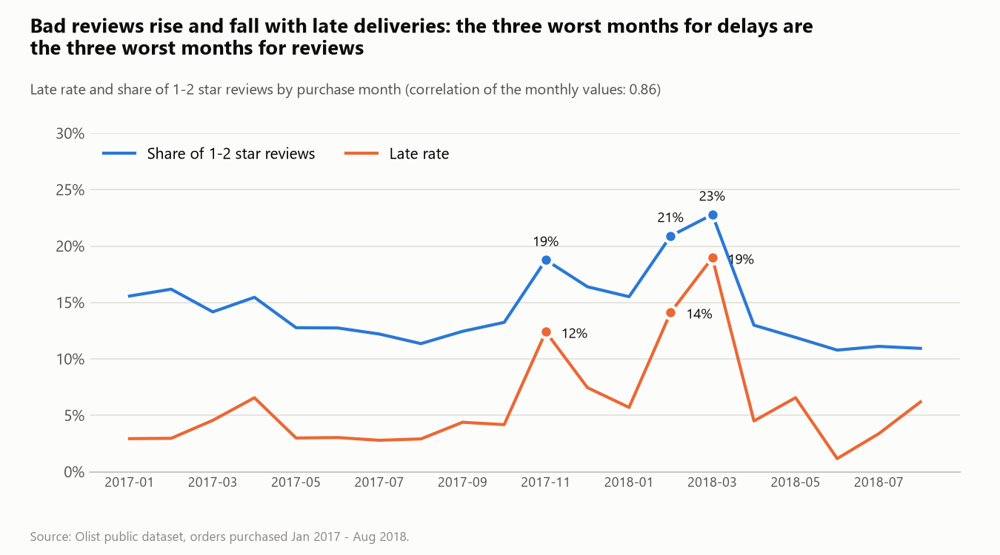
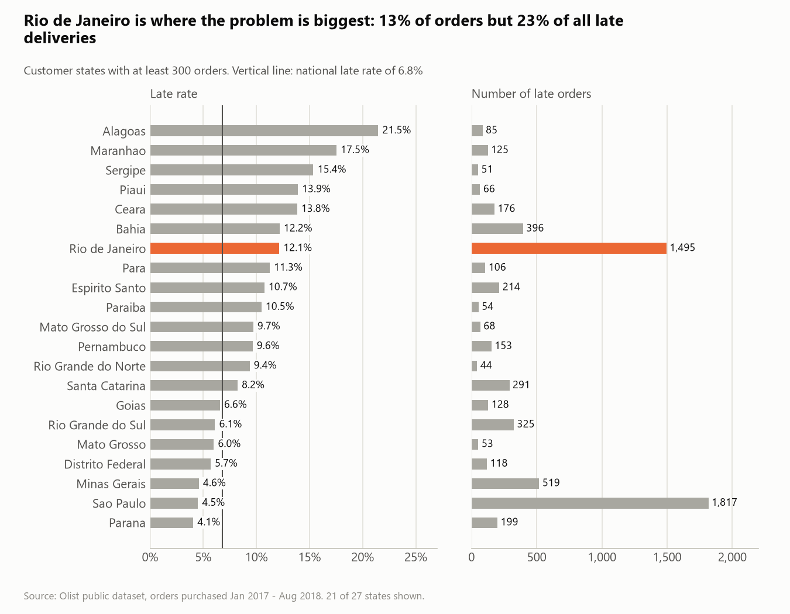
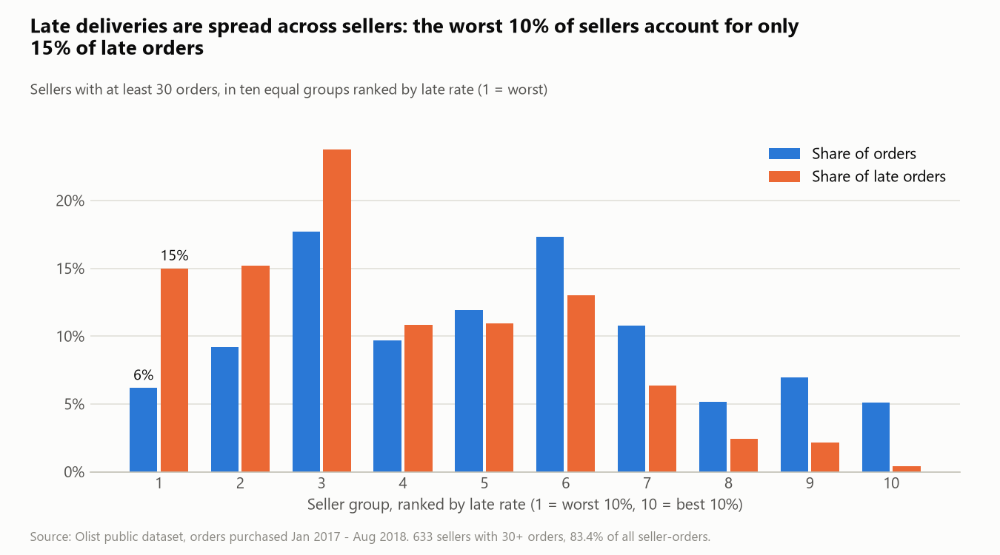
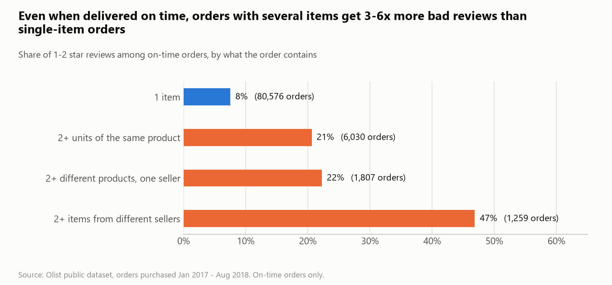
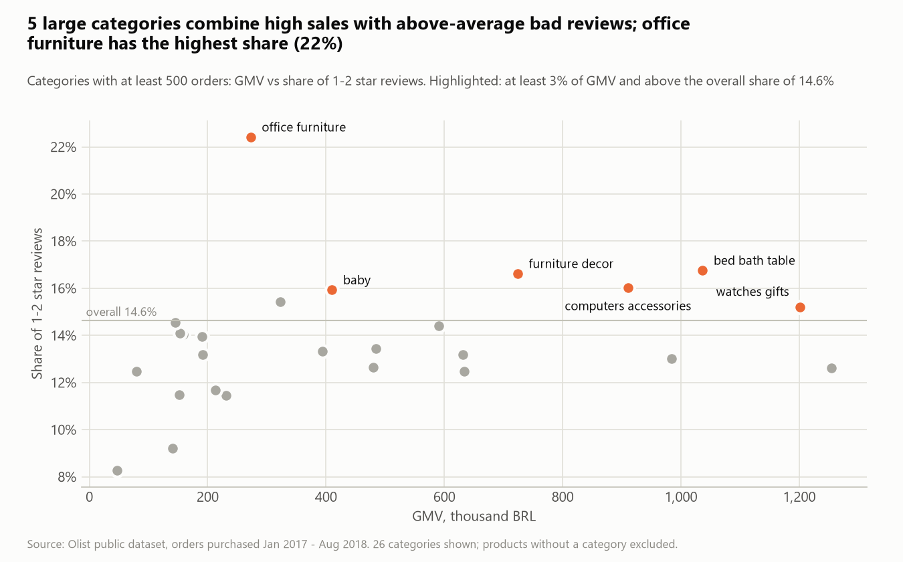
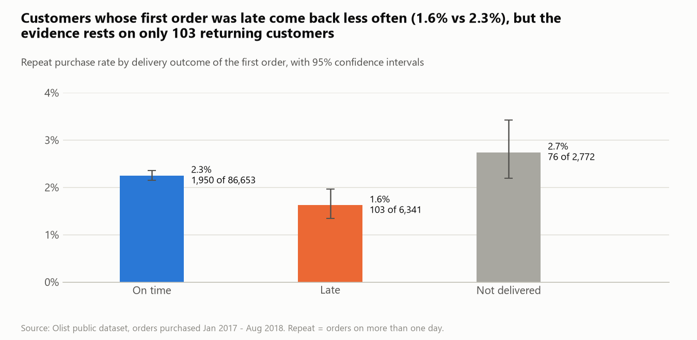

# Analysis findings: why are customers unhappy?

Hypothesis-driven analysis of 99,092 Olist orders (purchased January 2017 to August 2018).
Every number on this page comes from [`analysis_results.md`](analysis_results.md), generated by
[`notebooks/04_hypothesis_analysis.py`](../notebooks/04_hypothesis_analysis.py); table references such as
*A2* point to that file. Metric definitions: [`metric_definitions.md`](metric_definitions.md).

**Outcome metric:** share of reviewed orders with a 1–2 star review ("bad reviews"). Overall: 14.6%
(14,382 of 98,330 reviewed orders).

## 1. The answer in three sentences

1. **Broken delivery promises are the strongest driver of bad reviews.** Late and undelivered orders are 9.5%
   of orders but account for 42.7% of all bad reviews: 62.4% of late orders and 78.0% of undelivered orders get
   1–2 stars, against 9.2% of on-time orders.
2. **The problem sits in the carrier leg and on specific routes, not with a few bad sellers.** 72.3% of late
   orders were handed to the carrier in time by the seller; Rio de Janeiro alone has 12.9% of orders but 22.9%
   of late deliveries; the worst 10% of sellers account for only 15.0% of late orders.
3. **Delivery is not the whole story: 57.3% of bad reviews come from orders that arrived on time.** Orders
   with several items stand out: delivered on time, they still get 1–2 stars 21–47% of the time, against 7.5%
   for single-item orders. The reason is not visible in the numbers and is tested in the review coding (Phase 5).

All three statements describe associations in observational data. Section 5 explains how far they can be read
as causes.

## 2. Issue tree

```
Why are customers unhappy?  (14.6% of reviewed orders get 1-2 stars)
|
|-- WHAT went wrong for the customer?
|   |
|   |-- A. Delivery: the order did not arrive when promised
|   |     |-- H1  arrived after the promised date
|   |     |-- H2  never arrived
|   |     |-- H3  arrived on time, but the wait was long
|   |
|   |-- B. Product: the order arrived, but was not what the customer expected
|   |     |-- H5  orders with several items disappoint more often
|   |     |-- H6  some product categories are structurally worse
|   |
|   |-- C. Price: the customer paid too much for what they got
|         |-- H4  freight is high relative to the product price
|         |-- H11 expensive orders create higher expectations
|
|-- WHERE does the problem concentrate?  (who owns the fix)
    |
    |-- D. Seller
    |     |-- H7  a small group of sellers causes most of the problem
    |     |-- H8  sellers hand parcels to the carrier too late
    |
    |-- E. Geography
          |-- H9  certain customer states are far worse than others
          |-- H10 long-distance shipments fail more often
```

The first level separates causes (what the customer experienced) from concentration (where to act). Within
"what", the three branches follow the order journey: getting it, opening it, paying for it.
One further question follows from the tree: **H12, does a bad first experience stop customers from coming back?**

## 3. Hypotheses, tests and conclusions

| # | Hypothesis | Test | Result | Conclusion |
|---|---|---|---|---|
| H1 | Orders delivered after the promised date get more bad reviews | Bad review share by delivery outcome and by delay band (*A1, A2*); same comparison inside regions, order sizes, value bands and years (*G1–G4*) | On time 9.2%, late 62.4%. Rises with the delay: 32.1% (1–3 days), 67.7% (4–7), 80.2% (8–14), 78.3% (15+). The gap is 51–56 points in every region, value band and year; it is smaller (41.6 points) for multi-item orders, whose on-time baseline is already high | **Supported.** Large, graded and stable across groups |
| H2 | Orders that never arrive get more bad reviews | Bad review share of not-delivered orders, by status (*A1, A3*) | 78.0% bad reviews. 2.9% of orders, 15.0% of all bad reviews. Largest groups: shipped but not delivered (1,097 orders, 69.4%), unavailable (602, 84.9%), canceled (580, 76.1%) | **Supported** |
| H3 | A long wait hurts even when the promise is kept | Bad review share of on-time orders by delivery time (*A5*) | 7.5% for 0–7 days, rising steadily to 20.6% for 29+ days. Same pattern for single-item orders: 5.9% to 19.0% | **Supported.** Speed matters, not only the promise. Smaller effect than H1 |
| H4 | High freight relative to the price causes bad reviews | Bad review share by freight-to-price ratio, single-item on-time orders (*E2*) | Flat: 7.9%, 7.5%, 7.2%, 7.8% across the four bands | **Not supported** |
| H5 | Orders with several items disappoint more often | Bad review share of on-time orders by order composition (*B1*) | 1 item 7.5%; 2+ units of one product 20.6%; 2+ products from one seller 22.2%; items from several sellers 46.9%. These orders are 10.1% of on-time orders and 26.8% of their bad reviews | **Supported.** Mechanism unclear from the numbers; to be tested in Phase 5 |
| H6 | Some categories are structurally worse | Bad review share by category, overall and for single-item on-time orders (*B2, B3*) | Office furniture is the outlier: 22.4% overall, 14.2% in the clean comparison (median category 6.7%). The large categories with high overall shares (bed bath table 16.8%, furniture decor 16.6%, computers accessories 16.0%) drop to 8.0–9.3% in the clean comparison | **Partly supported.** One clear outlier; for the rest, most of the gap is order size and delivery, not the category |
| H7 | A small group of sellers causes most of the problem | Share of late and bad-review orders held by the worst 10% of sellers with 30+ orders (*C2–C4*) | Worst 10% by late rate (64 sellers): 6.2% of orders, 15.0% of late orders. Worst 10% by bad review share: 8.1% of orders, 16.2% of bad reviews. The largest 10% of sellers have 68.3% of orders and 69.4% of late orders | **Partly supported.** The worst sellers are over-represented about 2x, but 85% of late orders come from the other sellers |
| H8 | Sellers hand parcels to the carrier too late | Late rate by seller handover; time split between seller and carrier (*C5, A6*) | Late handover raises the late rate from 5.4% to 21.1%. But 72.3% of late orders were handed over in time. Median carrier transit: 26 days for late orders vs 7 for on-time; median seller handling: 4 vs 2 days | **Partly supported.** Late handover is a real risk factor, but most delay arises after the seller, in transit |
| H9 | Certain customer states are far worse | Late rate, late orders and bad review share by state (*D1, D2*) | Late rate from 4.1% (Parana) to 21.5% (Alagoas). Northeast region 12.8% vs Southeast 6.1%. Rio de Janeiro: 12.9% of orders, 22.9% of late orders, 659 late orders more than at the national rate, the largest excess of any state (next: Bahia, 175) | **Supported.** Rio de Janeiro for volume, the Northeast for rate |
| H10 | Long-distance shipments fail more often | Same-state vs cross-state shipments (*D4*) | Cross-state: median 13 days, 8.1% late, 15.5% bad reviews. Same-state: 6 days, 4.5%, 11.7% | **Supported** |
| H11 | Expensive orders get more bad reviews | Bad review share by order value, all orders and single-item on-time orders (*E1*) | All orders: rises from 12.3% to 19.6%. Clean comparison: flat at 7.2–7.9% up to 500 BRL, 9.8% above | **Not supported.** The raw pattern is explained by order size and delivery. Weak signal above 500 BRL only |
| H12 | Customers with a late first order come back less often | Repeat purchase rate by outcome of the first order, with 95% confidence intervals (*F1–F3*) | Late 1.62% (CI 1.34–1.97%) vs on time 2.25% (CI 2.15–2.35%). Same direction for the 2017 cohort: 2.14% vs 3.21%. Not-delivered customers return at 2.74% | **Unclear.** The direction fits, but it rests on 103 returning customers, and the not-delivered group contradicts a simple "bad experience means lost customer" reading |

## 4. Findings in detail

### 4.1 Where the 14,382 bad reviews come from

| Source | Orders | Bad reviews | Share of all bad reviews |
|---|---|---|---|
| Late delivery | 6,531 | 3,981 | 27.7% |
| Not delivered | 2,881 | 2,153 | 15.0% |
| On time, several items | 9,096 | 2,213 | 15.4% |
| On time, single item | 80,576 | 6,034 | 42.0% |

(*A1, B1*; one further bad review belongs to the 8 orders with unknown outcome.)

The first two rows are the delivery problem: 9.5% of orders, 42.7% of bad reviews. The last row is the baseline:
most orders, with a 7.5% bad review share. What those customers complain about cannot be answered with
numbers; it is the purpose of the review coding.



### 4.2 The longer the delay, the worse the reviews


An order 1–3 days late already triples the bad review share (32.1% vs 9.2%). From 4 days late, two out of
three customers give 1–2 stars; from 8 days, four out of five, the same level as an order that never arrives.
Practical meaning: the first three days after the promised date are the window where damage can still be
limited.

**The survey design sharpens this effect.** Olist sends the review survey around the promised date if the
order has not arrived by then (decision #15). Of the late orders with a review, 4,471 were reviewed before the
parcel arrived and 80.7% of those gave 1–2 stars; the 1,907 reviewed after arrival gave 1–2 stars 19.5% of the
time (*A4*). These two groups also differ in how late the order was, so the comparison is not clean, but it
shows that a large part of the bad reviews on late orders are written by customers who are still waiting.

### 4.3 Bad reviews move with late deliveries over time



The three months with the highest late rates (November 2017: 12.4%; February 2018: 14.1%; March 2018: 19.0%)
are the three months with the highest bad review shares (18.8%, 20.9%, 22.8%). The correlation of the 20
monthly values is 0.86 (*A7*). The best month, June 2018, has a late rate of 1.2% and a bad review share of
10.8%.

### 4.4 Where the delivery problem sits



- **Rio de Janeiro** is the largest single problem: 12,792 orders, late rate 12.1% against 6.8% nationally,
  1,495 late orders. Sao Paulo has more late orders in absolute terms (1,817) but on three times the volume
  and with a late rate below the national rate (4.5%).
- **The Northeast** has the highest late rates (Alagoas 21.5%, Maranhao 17.5%, Sergipe 15.4%, Ceara 13.8%,
  Bahia 12.2%) on smaller volumes.
- **It is a transit problem more than a seller problem.** For late orders the median time with the carrier is
  26 days, against 7 for on-time orders; the median promised time is almost identical (23 vs 24 days) (*A6*).
  72.3% of late orders left the seller in time (*C5*).



Removing or fixing the worst 64 sellers would address at most 15.0% of late orders. The late rate does differ
strongly between sellers (16.5% in the worst group, 0.5% in the best), so seller management is useful, but it
is not where most of the volume is.

### 4.5 Orders with several items



This pattern was not in the original hypotheses. It holds for on-time orders, so late delivery does not
explain it, and it is strongest when the items come from different sellers. One possible explanation is that
the order is recorded as delivered when the first parcel arrives while other parcels are still on the way.
This is a HYPOTHESIS, not a finding: the data has one delivery date per order and cannot confirm it. The
review coding will check whether these customers complain about missing items.

### 4.6 Categories



Five large categories (each at least 3% of GMV) have a bad review share above the overall 14.6%: bed bath
table, furniture decor, computers accessories, baby, and watches gifts. In the clean comparison (single-item,
on-time orders) they fall to 7.9–9.3%, close to the median category (6.7%). Office furniture stays high in
both views (22.4% and 14.2%) and is the one category that looks like a product or fulfilment problem of its
own. It is 2.0% of GMV.

### 4.7 Do unhappy customers come back?



Customers whose first order was late return less often (1.62% vs 2.25%), and the confidence intervals do not
overlap. This is the only evidence in the data that links late delivery to lost future business, and it is
thin: 103 returning customers, in a marketplace where only 2.2% of customers return at all. It is reported as
an indication, and it is not used to put a money value on late deliveries.

## 5. Correlation or causation?

Nothing in this analysis is an experiment. No customer was randomly assigned a late delivery. What can be said:

**Reasons to read the delivery effect as largely causal**

- **Size.** 62.4% vs 9.2% is too large to be produced by a plausible hidden factor.
- **Dose-response.** The bad review share rises step by step with the length of the delay (*A2*).
- **Order in time.** The delay comes first, the review second.
- **Consistency.** The gap is 51–56 points in all five regions, all five value bands and both years, and 41.6 points even for multi-item orders (*G1–G4*).
- **Mechanism.** The survey reaches most late customers while they are still waiting (*A4*, decision #15).

**Reasons for caution**

- **Unobserved factors.** Carrier, product type or seller behaviour could cause both the delay and the
  dissatisfaction. Only factors that exist in the data could be checked.
- **Measurement.** The survey timing means the score partly measures "has it arrived yet". A survey sent after
  delivery to every customer could show a smaller gap.
- **Selection.** 2.3% of late orders have no review against 0.5% of on-time orders (decision #13).
- **Aggregates.** The monthly correlation of 0.86 compares 20 monthly averages, not individual orders.

**Wording used in the deliverables:** late delivery is "the strongest driver of" or "strongly associated with"
bad reviews. The observed difference between late and on-time orders is used in Phase 6 as an **upper estimate**
of what fixing delivery could achieve, not as a guaranteed effect.

## 6. What this means for the storyline

| Planned finding | What the data says | Change |
|---|---|---|
| Delivery delay is the main driver of bad reviews | Strongest single driver, but 57.3% of bad reviews come from on-time orders | Keep, with honest sizing: "9.5% of orders, 42.7% of bad reviews". Add not-delivered orders, which were not in the original plan |
| Where the problem sits: states and sellers | States: yes (Rio de Janeiro, Northeast). Sellers: weak concentration | Reframe: routes and carriers first, sellers second |
| What customers complain about | Not answered yet | Phase 5 must explain the on-time bad reviews, especially multi-item orders |
| Freight cost and price as causes | Not supported | Drop from the deck; mention in one line as tested and rejected |

Candidate actions for the recommendation slide, to be finalised after Phase 5 and Phase 6:

1. Carrier performance on the Rio de Janeiro and Northeast routes (largest excess of late orders).
2. Proactive contact in the first three days after a missed promise (the window before bad reviews jump from 32% to 68%).
3. Orders that never arrive: product unavailable, canceled, shipped but not delivered (15.0% of bad reviews).
4. Orders with several items or sellers (15.4% of bad reviews), once Phase 5 has identified the cause.

## 7. Limitations of this analysis

- Observational data: associations, with the causal reading argued in section 5.
- The review score rates the whole order; for multi-seller orders it cannot be assigned to one seller.
- Seller and category rates are only shown for groups with enough orders (30+ per seller, 500+ per category).
- States with fewer than 300 orders are left out of the state chart; their rates are too unstable to rank.
- The repeat purchase analysis rests on 2,129 repeat customers in total.
- Distance is approximated by "same state or not"; no kilometre distance was computed.
