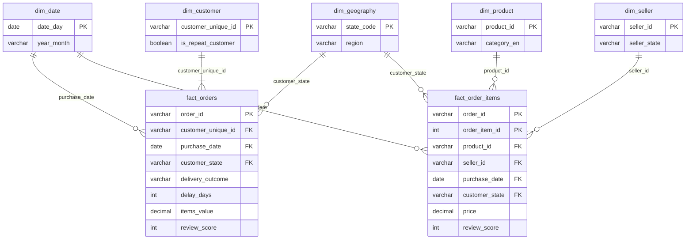

# Data model

A star schema built in DuckDB from the nine raw Olist tables. Two fact tables share the date and geography
dimensions. Row counts come from [`model_validation_report.md`](model_validation_report.md), which also holds
the 36 tests that reconcile the model with the raw data.

## 1. Diagram

| Table | Rows | Grain (one row is...) | Key |
|---|---|---|---|
| `fact_orders` | 99,092 | one order | `order_id` |
| `fact_order_items` | 112,279 | one unit sold | `order_id` + `order_item_id` |
| `dim_customer` | 95,774 | one person | `customer_unique_id` |
| `dim_seller` | 3,095 | one seller | `seller_id` |
| `dim_product` | 32,951 | one product | `product_id` |
| `dim_date` | 608 | one calendar day, 2017-01-01 to 2018-08-31 | `date_day` |
| `dim_geography` | 27 | one Brazilian state | `state_code` |

## 2. Why this design

- **Two fact tables, two grains.** Delivery and satisfaction happen once per order, so they live in
  `fact_orders`. Seller and category belong to an item (1,278 raw orders have more than one seller), so they
  need `fact_order_items`. Putting everything in one table would either repeat the order for every item
  (double counting orders and reviews) or lose the seller.
- **No fact-to-fact join.** The delivery outcome and review score of the order are copied onto its items, so
  each fact table can be analysed on its own with its dimensions.
- **Natural keys.** The source ids are already unique and stable, so no surrogate keys were added.
- **Dimensions hold descriptions, facts hold events and numbers.** Anything used to filter or group (state,
  region, category, month) is in a dimension; anything counted or summed is in a fact.

## 3. Build order

| Step | File | What it does |
|---|---|---|
| 0 | [`sql/00_load_raw.sql`](../sql/00_load_raw.sql) | Loads the CSV files unchanged into schema `raw` |
| 1 | [`sql/01_staging.sql`](../sql/01_staging.sql) | Applies the cleaning decisions (period, one review per order, delivery fields) in schema `stg` |
| 2 | [`sql/02_dimensions.sql`](../sql/02_dimensions.sql) | Builds the five dimensions in schema `model` |
| 3 | [`sql/03_facts.sql`](../sql/03_facts.sql) | Builds the two fact tables in schema `model` |
| 4 | [`sql/04_export.sql`](../sql/04_export.sql) | Exports the model to `data/processed/*.parquet` for Power BI |

All steps run with `python run_sql.py`. The model is then tested with `python notebooks/02_model_validation.py`.

## 4. Definitions of the derived fields

These definitions are the single source of truth. The numbers after # refer to
[`decision_log.md`](decision_log.md).

| Field | Definition | NULL when |
|---|---|---|
| Analysis period | Orders purchased from 2017-01-01 to 2018-08-31 (#1) | — |
| `is_delivered` | `order_status = 'delivered'` AND a customer delivery date exists (#5, #6) | never |
| `promised_days` | estimated delivery date − purchase date, in calendar days | never |
| `delivery_days` | customer delivery date − purchase date, in calendar days | order not delivered |
| `delay_days` | customer delivery date − estimated delivery date, in calendar days. Positive = late, zero or negative = on time (#3) | order not delivered |
| `is_on_time` | `delay_days <= 0` | order not delivered |
| `delivery_outcome` | `On time` (delivered, `delay_days <= 0`); `Late` (delivered, `delay_days > 0`); `Not delivered` (any status other than delivered) (#2); `Unknown` (status delivered but no delivery date: 8 orders) | never |
| `delay_band` | `On time`; `Late 1-3 days`; `Late 4-7 days`; `Late 8-14 days`; `Late 15+ days`; `Not delivered`; `Unknown`. `delay_band_sort` gives the display order. | never |
| `handling_days` | carrier handover date − purchase date, in calendar days: the time the seller needed (includes payment approval) | no carrier date, or the carrier timestamp is before the purchase (#8) |
| `transit_days` | customer delivery date − carrier handover date, in calendar days: the time the carrier needed | not delivered, no carrier date, or delivery before handover (#7) |
| `is_seller_handover_late` | carrier handover timestamp is later than the seller's shipping deadline (`shipping_limit_date`). In `fact_orders` the latest deadline of the order's items is used; in `fact_order_items` the item's own deadline. | no carrier date, or no items |
| `items_value` | sum of `price` of the order's items, in BRL. Freight not included (#20) | order has no item rows (#22) |
| `freight_value` | sum of `freight_value` of the order's items, in BRL | order has no item rows |
| `order_total` | `items_value + freight_value` | order has no item rows |
| `is_same_state` | in `fact_orders`: every seller of the order is in the customer's state. In `fact_order_items`: the item's seller is in the customer's state. Proxy for distance (#28) | order has no item rows |
| `review_score` | score (1–5) of the most recently answered review of the order (#4) | order has no review (#13) |
| `is_low_score` | `review_score <= 2` | order has no review |
| `has_comment` | the review has a non-empty comment message (#14) | never (false when there is no review) |
| `review_before_delivery` | the review was answered before the customer delivery timestamp (#15) | not delivered, or no review |
| `customer_order_number` | position of the order in the person's order history inside the analysis period, by purchase time (1 = first order) | never |
| `is_multi_seller_order` | the order contains items from more than one seller (#25) | never |
| `order_count` (dim_customer) | number of orders of the person in the analysis period | never |
| `purchase_day_count` (dim_customer) | number of different calendar days on which the person ordered | never |
| `is_repeat_customer` (dim_customer) | `purchase_day_count > 1` (#32) | never |
| `category_en` (dim_product) | English category name; `unknown` when the product has no category (#23, #24) | never |
| `seller_region`, `region` | one of the five Brazilian regions: North, Northeast, Central-West, Southeast, South | never |

## 5. Columns per table

### fact_orders

| Column | Type | Role |
|---|---|---|
| `order_id` | text | key |
| `customer_unique_id` | text | → `dim_customer` |
| `purchase_date` | date | → `dim_date` |
| `customer_state` | text | → `dim_geography` |
| `order_status` | text | original Olist status |
| `delivery_outcome`, `delay_band`, `delay_band_sort` | text, text, integer | delivery result |
| `is_delivered`, `is_on_time`, `is_seller_handover_late` | true/false | delivery flags |
| `promised_days`, `delivery_days`, `delay_days`, `handling_days`, `transit_days` | integer | durations in calendar days |
| `has_items`, `item_count`, `seller_count` | true/false, integer, integer | order content |
| `items_value`, `freight_value`, `order_total` | decimal (BRL) | order value |
| `is_same_state` | true/false | distance proxy |
| `has_review`, `review_score`, `is_low_score`, `has_comment`, `review_before_delivery` | true/false and integer | satisfaction |
| `customer_order_number` | integer | customer history |

### fact_order_items

| Column | Type | Role |
|---|---|---|
| `order_id`, `order_item_id` | text, integer | key |
| `product_id` | text | → `dim_product` |
| `seller_id` | text | → `dim_seller` |
| `purchase_date` | date | → `dim_date` |
| `customer_state` | text | → `dim_geography` |
| `price`, `freight_value` | decimal (BRL) | item value |
| `is_same_state`, `is_seller_handover_late` | true/false | item-level flags |
| `is_multi_seller_order`, `delivery_outcome`, `is_delivered`, `is_on_time`, `delay_days`, `has_review`, `review_score`, `is_low_score` | mixed | copied from the order |

### Dimensions

| Table | Columns |
|---|---|
| `dim_customer` | `customer_unique_id`, `first_purchase_date`, `first_order_state`, `order_count`, `purchase_day_count`, `is_repeat_customer` |
| `dim_seller` | `seller_id`, `seller_city`, `seller_state`, `seller_region` |
| `dim_product` | `product_id`, `category_pt`, `category_en` |
| `dim_date` | `date_day`, `year`, `quarter`, `month_number`, `month_name`, `year_month`, `month_start`, `weekday_number`, `weekday_name`, `is_weekend` |
| `dim_geography` | `state_code`, `state_name`, `region` |

## 6. Relationships to create in Power BI

All relationships are one-to-many, single direction, from the dimension to the fact.

| From (one side) | To (many side) |
|---|---|
| `dim_date[date_day]` | `fact_orders[purchase_date]` |
| `dim_geography[state_code]` | `fact_orders[customer_state]` |
| `dim_customer[customer_unique_id]` | `fact_orders[customer_unique_id]` |
| `dim_date[date_day]` | `fact_order_items[purchase_date]` |
| `dim_geography[state_code]` | `fact_order_items[customer_state]` |
| `dim_product[product_id]` | `fact_order_items[product_id]` |
| `dim_seller[seller_id]` | `fact_order_items[seller_id]` |

Do not relate the two fact tables to each other.

## 7. Limitations of the model

- **Order counts on `fact_order_items` need a distinct count.** One order has several rows there, so the number
  of orders of a seller or category is `COUNT(DISTINCT order_id)`, never a row count.
- **Order-level results on items are an attribution, not a measurement.** A late delivery or a low score is
  copied to every item of the order. For the 1.3% of orders with several sellers, this can blame a seller who
  did nothing wrong (#25).
- **"First order" means first order in the analysis period.** 329 orders from 2016 were excluded (#1), so a
  few customers counted as new had ordered before.
- **`handling_days` includes payment approval time**, which the seller does not control.
- **Geography is the customer's delivery state.** The seller's state is only available through `dim_seller`.
